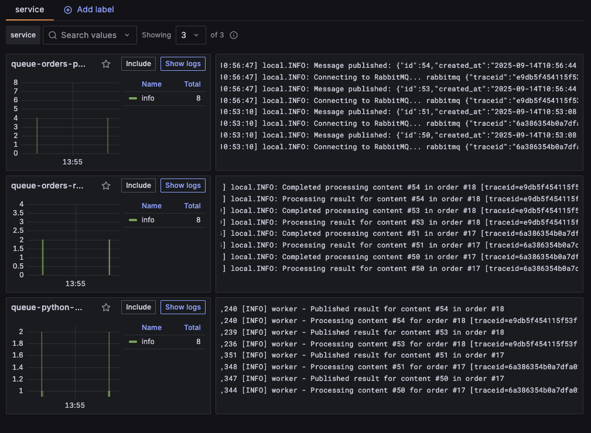
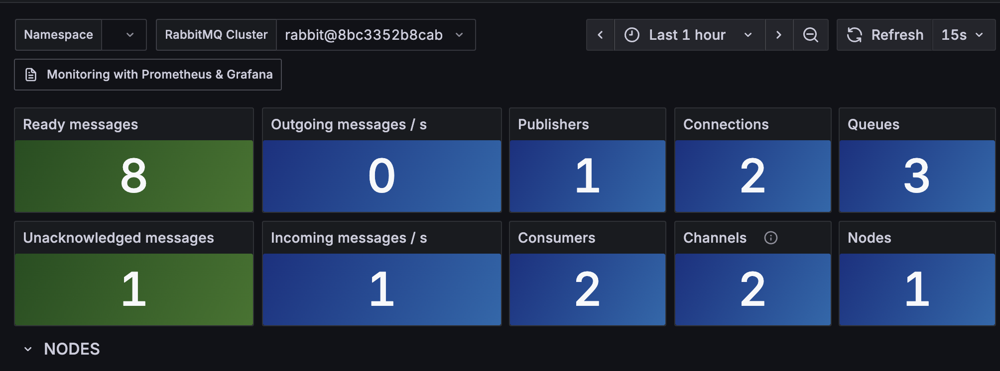
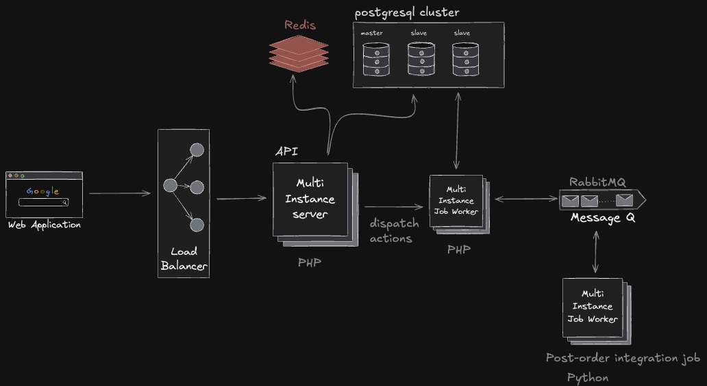

## Developer’s Notes
### Background
I haven’t primarily worked with PHP before, but I have to say that Laravel has been the easiest development experience I’ve ever had. It comes with so many built-in features that make getting things done straightforward and efficient. I was probably two times more efficient than in Node.js, even for someone outside of the PHP world. And I hate to admit this.

### Concurrency
Idempotency is enforced using a hash of the request’s client data. If the same client submits a request within 30 seconds, the second request is treated as a duplicate and blocked. These hashes are stored in Redis with a TTL. I wouldn’t use this exact implementation in the real world but the idea is there.

The idempotent key could also incorporate other parts of the request payload, depending on the application’s requirements. In practice, I would likely include a UUID in the request headers when sending from the user’s browser, ensuring each order event can be uniquely identified. Generating a new UUID when the user creates a new real order, not an accidental spam order.

### Queue
Third-party API processing is offloaded to a Python batch job to reduce the load on the API instance. Message queuing is split between Laravel and RabbitMQ: Laravel ensures messages are successfully published to RabbitMQ, handling retries and reruns of failed jobs. RabbitMQ, together with Python, executes the post-order integration job, using a dead-letter queue to retry failed tasks. Once processing is complete, the result is sent back to Laravel to update the database. This avoids duplicating database models in Python. The Python component could just as well have been implemented in PHP, but I chose Python as an experiment to see how it would work. Could have also just used Laravel Horizon.

Queues respect priority on both ends: Laravel and Python. Priority is read from orders meta field. Supporting low, normal (same as not defined), high, critical and max.

### Monitoring
**_This part was a bit extra but I just wanted to see how to instrument PHP, RabbiMQ and Python with monitoring._**

Monitoring is powered by an open-source stack consisting of Tempo, Loki, Prometheus, Grafana, Alloy, and OpenTelemetry. Logs are collected from the API and all queue job workers, aggregated into Loki. Metrics are gathered from Laravel and RabbitMQ and stored in Prometheus. Distributed traces are sent to Tempo, while Grafana provides visualization across logs, metrics, and traces.

### System Design

Architecture is designed, so that each of the components can be scaled invidually if and when the load increases or fail in isolation without affecting other parts.

## Setup

Build local dockerfiles

    docker compose build

Run docker compose
    
    docker compose up -d

Initialize database
    
    docker exec -it smindle-php-web-1 php artisan migrate

## Requests

Register an user and retrieve token:

    curl --location 'http://127.0.0.1:8001/api/register' \
        --header 'Accept: application/json' \
        --header 'Content-Type: application/json' \
        --data-raw '{
            "name": "Alice",
            "email": "alice@example.com",
            "password": "secret123",
            "password_confirmation": "secret123"
        }'

Token is returned in format: `"token": "1|rEJkKh3TnPbEk2PioSe2tlBziFYgHuEUG8yiUafd2d0c67d1"`. Ignore the first number and pipe characters `1|`. Copy the rest to replace `<TOKEN>` in the next command.

Make an order request:

    curl --location 'http://127.0.0.1:8001/api/orders' \
        --header 'Accept: application/json' \
        --header 'Content-Type: application/json' \
        --header 'Authorization: Bearer <TOKEN>' \
        --data '{
            "client": {
                "identity": "Alan Turing",
                "contact_point": "123 Enigma Ave, Bletchley Park, UK"
            },
            "contents": [
                {
                    "label": "Smindle ElePHPant plushie",
                    "kind": "single",
                    "cost": 295.45,
                    "meta": {}
                },
                {
                    "label": "Syntax & Chill",
                    "kind": "recurring",
                    "cost": 175.00,
                    "meta": {
                        "priority": "high"
                    }
                },
                {
                    "label": "Syntax & Chill: Special Edition",
                    "kind": "recurring",
                    "cost": 200.00,
                    "meta": {
                        "frequency": "unspecified",
                        "priority": "high"
                    }
                }
            ]
        }'

## Monitoring

Login to Grafana: http://localhost:3000. Use admin:admin credentials and on the next screen click 'skip'.

### Logs
Navigate to `Drilldown` -> `Logs`.

### RabbitMQ
Navigate to `Dashboards` -> `RabbitMQ-Overview`.

## Commands

If jobs fails to run in Laravel side, you can promote them back to queue:

    docker exec -it smindle-php-web-1 php artisan queue:retry <id>
    docker exec -it smindle-php-web-1 php artisan queue:retry "all"

If jobs fails to succeed in Python side, you can promote them back to queue:

    docker exec -it smindle-php-queue-python-worker-1 python3 promote.py
